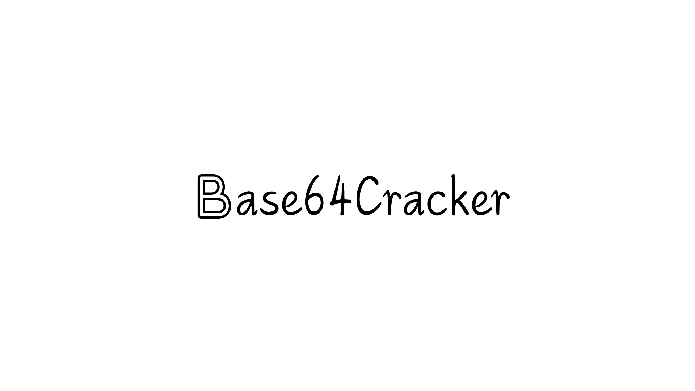
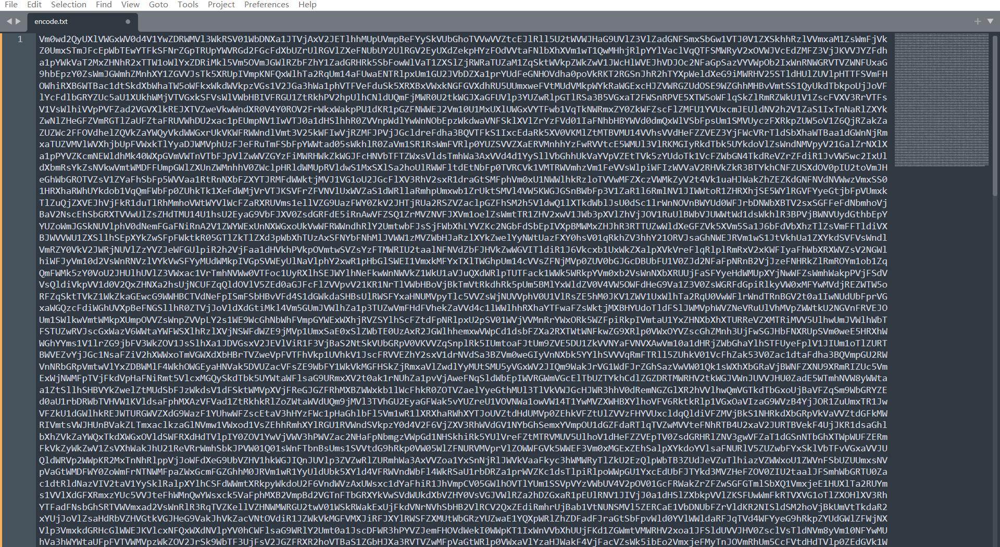
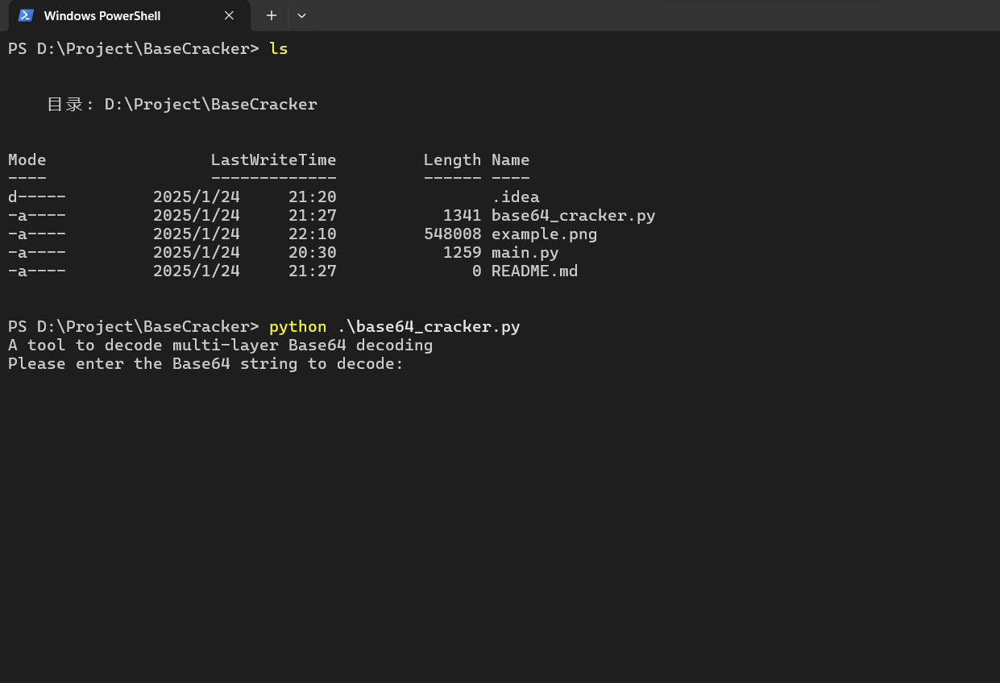

[中文文档README📖](README_ZH.md) 

[English README📖](README.md)

## Overview

As a CTFer, we may come across strings that go through many layers of Base encoding.And if we decode it manually, it will be very troublesome.So this is a tool to decode multi-layer Base64 encoding strings.



This is an example.

## 二、About

I use these libraries for my development work.

```
base64
```

```
binascii
```

```
re
```

Please use this command to decode the base64 encoding strings.

```
python base64_cracker.py
```



Then input the strings to decode.


#### Enjoy hacking~

###### This tool is will being updated constantly.

###### Thanks to your star~
