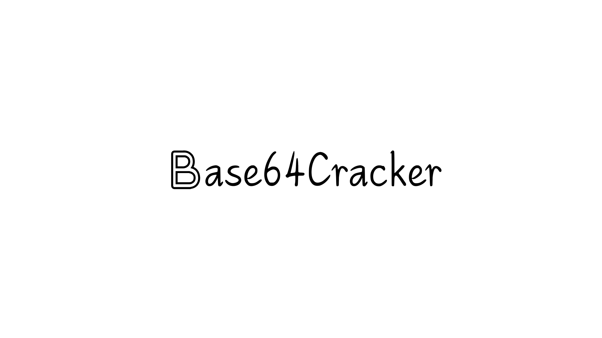
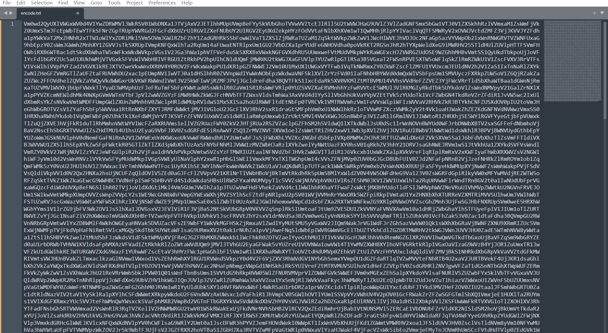
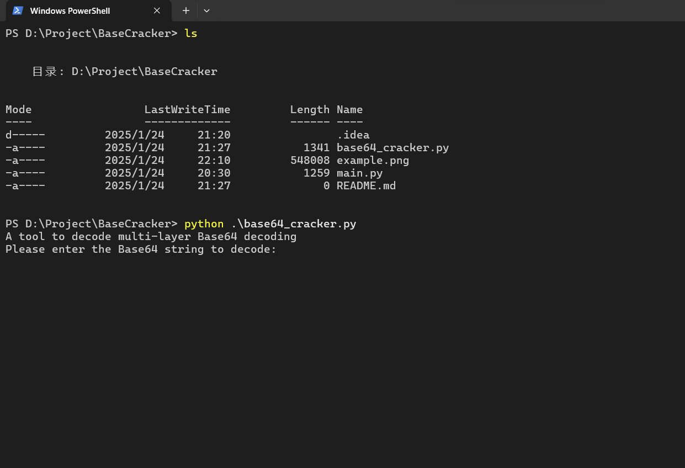
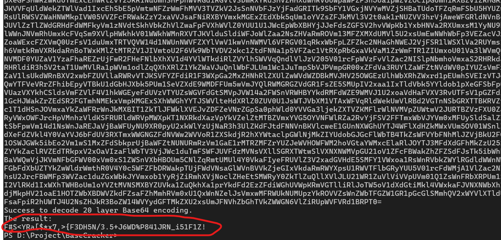

[中文文档README📖](README_ZH.md) 

[English README📖](README.md)

作为一名CTFer，我们在做Misc方向的题目时会遇到奇奇怪怪的Base编码题，例如我之前做过的一道需要解18次的题目，那这时候我们不想重复CV工程这么多次的话我们的最优解就是用脚本，因此有了此工具



如图像这样密密麻麻的字符串对于我这种CTF小白那看得头皮发麻，后续这个工具我也会进行不断完善，例如支持Base家族的其他编码

###### 这是我的第一个小项目，如果你觉得这个小工具帮助到了你，欢迎赏个Star~


## 二、唠嗑

在开发的过程中使用了以下库

```
base64
```

```
binascii
```

```
re
```

食用方法（超级简单，放心食用~）

```
python base64_cracker.py
```



然后将待解码字符串粘贴进去即可



不知道该写什么了
